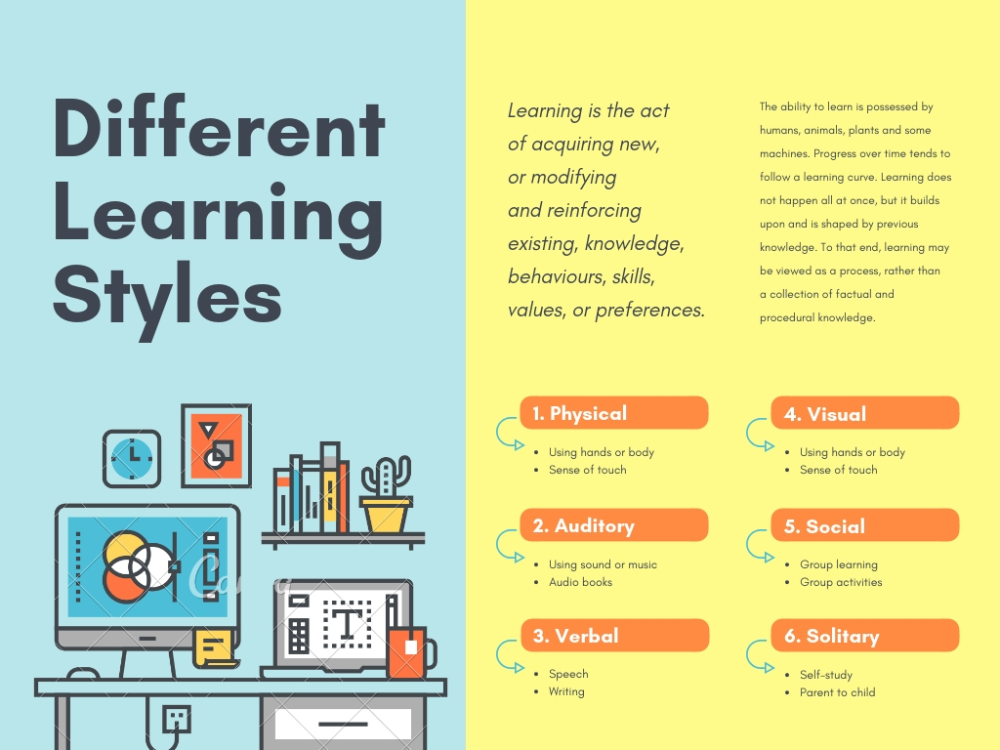

# YorkUHacks_2018
## YorkU Hacks submission! Winner of the Lassonde 50/50 Challenge!
### September 23, 2018

We are the Focus Finders!! We believe that quality education can be expanded to learners with unconventional learning styles. Our mission is to ensure that everyone has access to quality education that is tailored to their needs because embracing the diverse backgrounds of all people is the biggest drive to success!

As passionate students who value the opportunity of education, we felt it was imperative to use this opportunity to address the digressions in the quality of education available for individuals with unconventional learning styles.

After looking at the learning experiences of our peers, we decided that we wanted to focus on helping learners with attention deficit/hyperactivity disorder (ADHD) take control of their education in order to tackle the United Nations 4th Sustainable Development Goal. We believe that providing the means for equitable education forges a new era of advancements of pushing the conventional limits of possibility.

We want to expand our project to accommodate a wide range of subjects with a specific target for high school students. The project can be used and accessed by anyone to ensure they are receiving high quality education regardless of their background, geographical location or socioeconomic status. Platforms such as Khan Academy are great, but are only tailored to one or two learning styles. We want to be able to incorporate lessons for everyone to get the most out of it.

Some of the different learning styles include:

Graphic and information from Canva

***Contributions By:*** [Kanza](https://www.linkedin.com/in/kanzash/), [Sadaam](https://www.linkedin.com/in/sadaam-ahmed-66b52a114/), [Aaisha](http://www.linkedin.com/in/aaisha-ameen), and Sparsh, [Anemme](https://www.linkedin.com/in/anemmeabasi/)

### Instructions to Run

Download package and start with landing.html
